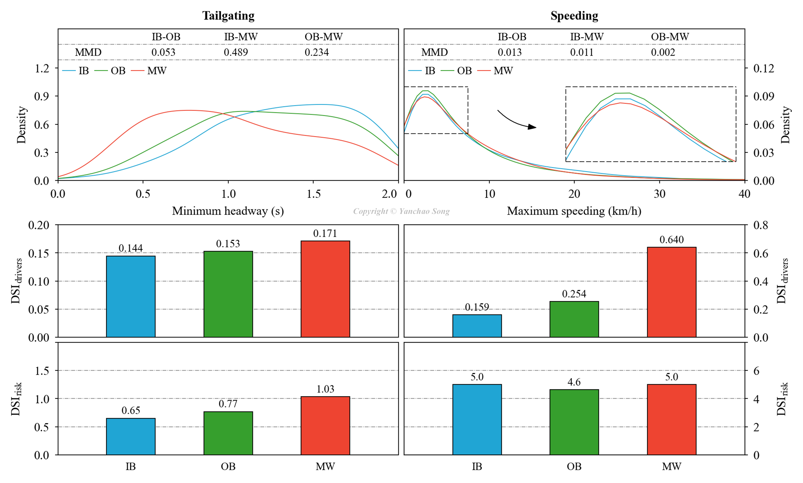

## Research Topic
📚 Development of a framework for risky driving scenario identification, individual risk assessment, and group risk differences estimation using naturalistic driving data from the i-DREAMS project

## Research Progress
✅ Completed

## Publication
🧾 [Accident Analysis & Prevention](https://doi.org/10.1016/j.aap.2025.107993)

## Highlights
✨ Drivers' risk tendencies can be accurately identified within risky driving scenarios. 
✨ Weighted probability of multi-threshold events (WPMTE) is a promising risk indicator. 
✨ Probability-based driving risk is overestimated with an increase in driving exposure. 
✨ The driving risks vary among driver groups across different ages and countries. 
✨ WPMTE-based risk assessment can distinguish drivers with diverse styles and offenses. 

## Abstract
📝 Driver-related factors, such as driving style and traffic offenses, are key contributors to road crashes, with driving risk varying substantially among individuals. Accurate assessment of individual driving risk and identification of high-risk driver characteristics are essential to reducing road crashes. Despite numerous studies on driving risk assessment, most rely solely on the frequency of single-threshold events, making them insufficiently comprehensive. Moreover, these studies neglect the repetitive nature of driving scenarios and differences in exposure, leading to imprecise assessments when using distance traveled as a measure of exposure. To address these shortcomings, we collected 18 weeks of naturalistic driving data from 100 participants (50 from the UK, 50 from Belgium) and developed a framework for assessing individual driving risk, consisting of three parts (1) identification of risky driving scenarios, (2) assessment of individual driving risks, and (3) analysis of group risk differences to identify high-risk driver characteristics. Risky driving scenarios were characterized by critical events with high risk propensity and high heterogeneity among individual driving risks. Driving scenario indicators were developed that measure risk propensity and heterogeneity, enabling risk assessments based on the probability of critical events occurring in such scenarios. Individual driving risk was measured by the weighted probability of multi-threshold events (WPMTE) in risky driving scenarios and adjusted for differences in driving exposure. WPMTE provides a comprehensive and precise assessment of individual driving risks, aiding in the identification of high-risk drivers. Finally, statistical tests revealed significantly higher risks for young drivers (19–30) compared to middle-aged (46–60) and elderly drivers (61–79), as well as higher risks for Belgian drivers compared to UK drivers. These findings inform the development of tailored safety education and proactive interventions, promoting safer driving behaviors and reducing crash rates.

## Keywords
📌 Risky driving assessment 
📌 Risky driving scenarios 
📌 Risk indicators 
📌 Risky driving exposure 
📌 Naturalistic driving data 
📌 Driver characteristics 

## Key Results
🎨 **Scatter density plots and event parameter distributions**

  

🎨 **DSI curves for kinematic driving scenarios**

  

🎨 **DSIs for traffic offense scenarios**

  

🎨 **Correlation heat map & Weighting coefficients**

  

🎨 **Scatter plot**

  

## Contact Me
📧 If you are interested in this research and would like to talk more about it, just let me know!
